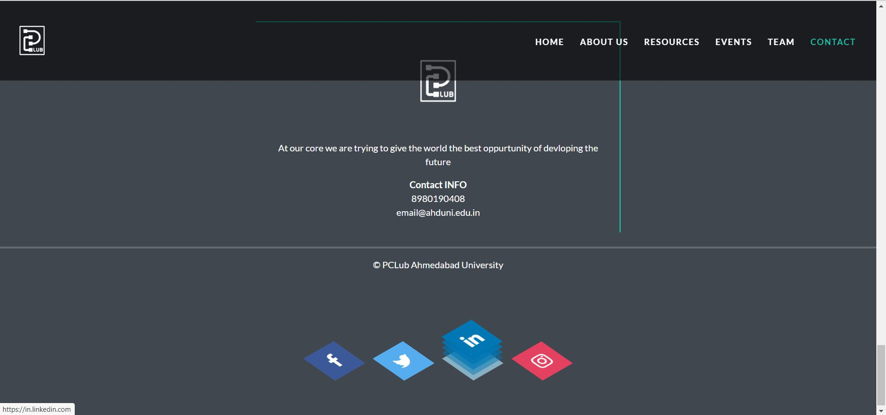

# Animated-Responsive-website
This is a responsive website with animations made for programming club .
We have made this using django,HTML,CSS and a bit of javascript and bootstrap.This website consists of pages like home, event, resource, about us. And all the pages are responsive 

The Home page has a navigation which takes to the specific part of the page and has a glimpse of all the pages, a floating image section and  contact information animations. Admin has all the access  to edit events, floating images, and the resources section.  
Where the event page is shown in the form of a timeline with options of live, upcoming and past events in the navigation bar , additional to that with a live timer for events coming up in next 6 hours.
Resources page consists of event cards, where each card has a poster of the resource and a short description with the link to it.
The About us page has details about the club, objectives and lists of committee members with their photos.  And the page has scroll and card animations.

## Authors
* [**Varshil Shah**](https://github.com/varshil1)
* [**Devam Shah**](https://github.com/Devam911)

**SCREENSHOTS OF THE WEBSITE**

# HOME PAGE :-

# ABOUT US PAGE :-

# RESOURCES PAGE :-

# EVENTS PAGE :-

# Responsiveness of WEBSITE :-

